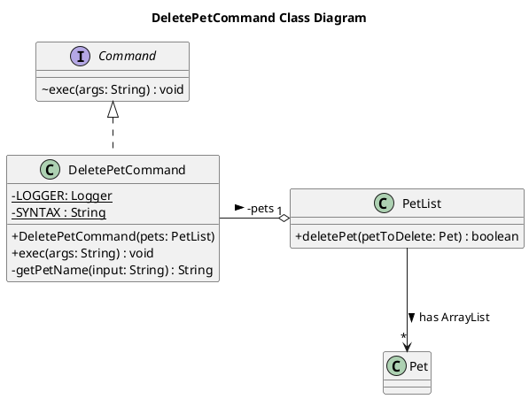
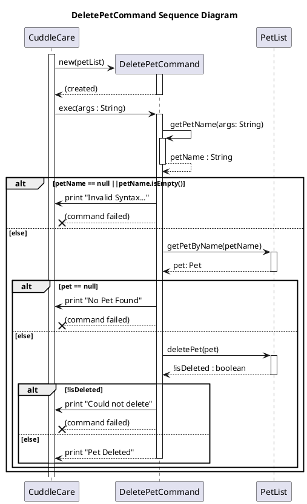
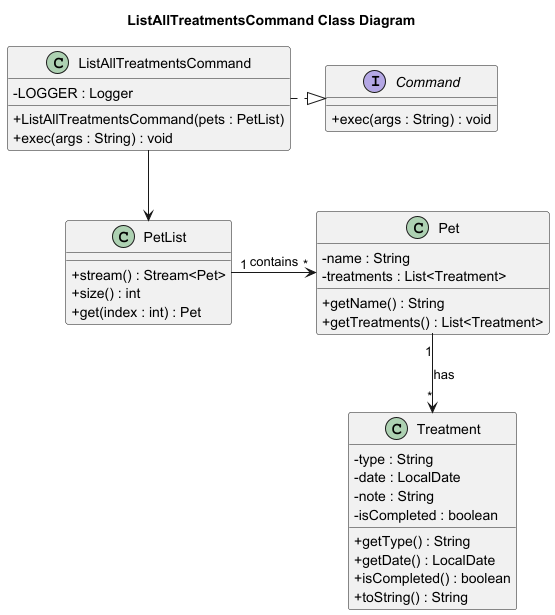
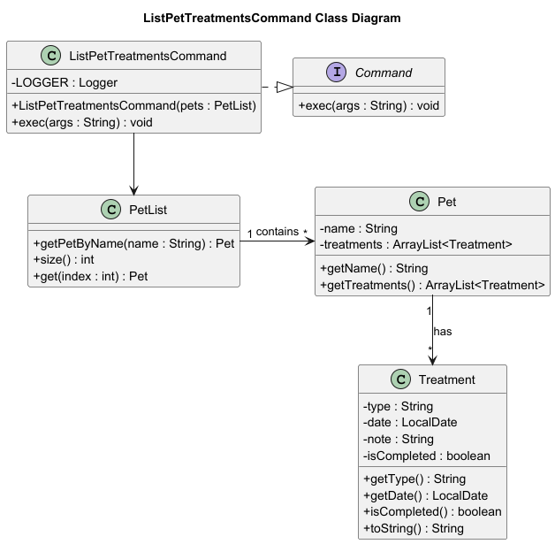

# Developer Guide

## Acknowledgements

{list here sources of all reused/adapted ideas, code, documentation, and third-party libraries -- include links to the
original source as well}

## Design & implementation

### Feature: Add Pet
{add details here}

### Feature: Delete Pet
This feature is built using the Command Pattern. This design decouples the invoker 
(main app logic) from the operation itself by using a Command interface. 
The DeletePetCommand is a concrete implementation of this interface that contains 
all the logic for parsing and execution.

As shown in the class diagram above, the DeletePetCommand does not manage the list directly. 
Instead, it holds a reference to a PetList instance (a "has-a" relationship, 
or Aggregation) that is provided to its constructor. This use of Dependency 
Injection makes the command highly testable, as the PetList can be easily mocked.

The execution flow starts when the exec method is called with the user's input. 
The command parses the string to find the pet's name, then validates the input by 
querying the PetList. If the syntax is correct and the pet exists, the 
command instructs the PetList to perform the actual deletion. The DeletePetCommand 
is also responsible for printing all relevant success or error messages to the user.

The detailed interaction between the main app (CuddleCare), DeletePetCommand, and 
PetList during execution is illustrated in the sequence diagram below.

### Feature: Edit Pet
{add details here}

### Feature: List Pets
{add details here}

### Feature: Find Pet
{add details here}

### Feature: Add Treatment
The diagram below shows how the AddTreatmentCommand class interacts with other components in the system.

The design follows a command-based architecture, where each command is encapsulated in its own class implementing the 
Command interface. AddTreatmentCommand depends on the PetList object, which stores all registered pets. Each Pet object 
maintains a list of Treatment objects.

When executed, the command:

1. Parses user input to extract the pet name (`n/`), treatment name (`t/`), and date (`d/`)
2. Retrieves the corresponding Pet object from the PetList using `getPetByName()`
3. Validates the date format using `LocalDate.parse()`
4. Creates a new Treatment object with the validated parameters 
5. Adds the treatment to the pet's treatment list via `addTreatment()`
6. Displays a confirmation message or error if validation fails

The command validates all inputs before modifying the pet's treatment list. If the pet is not found or the date format 
is invalid, appropriate error messages are displayed.

### Feature: Delete Treatment
The figure below shows how the DeleteTreatmentCommand interacts with other key classes in the system.

The DeleteTreatmentCommand follows a command-based architecture, where each command is encapsulated in its own class 
implementing the Command interface.

When the command is executed:
1. User input is parsed to extract the pet's name (`n/`) and treatment index (`i/`)
2. Command retrieves the corresponding Pet object from the PetList using `getPetByName()`
3. Validates that the index is within valid bounds 
4. Converts the 1-based user index to 0-based array index 
5. Removes the treatment from the pet's list using `removeTreatment()`
6. Displays a confirmation message with the deleted treatment's name

If the pet is not found or the index is invalid, the command prints an appropriate error message.

#### Design Considerations

Alternative 1 (current choice): Use index-based deletion.
Pros: 
* Always deletes exactly one specific treatment. 
* Easier for user to type out.

Cons: 
* Requires users to know or look up the index.

Alternative 2: Use treatment name for deletion.

Pros: 
* More intuitive for users who remember treatment names.

Cons: 
* Ambiguous when multiple treatments have similar names. 
* Requires additional confirmation steps.

### Feature: Mark a treatment as done
{add details here}

### Feature: Mark a treatment as not done
{add details here}

### Feature: Filter Treatment by Date
{add details here}

### Feature: List All Treatments across all pets
#### Design

The diagram below shows how the `ListAllTreatmentsCommand` class interacts with other components in the system.

The design follows a command-based architecture, where each command is encapsulated in its own class
implementing the `Command` interface.\
`ListAllTreatmentsCommand` depends on the PetList object, which stores all registered pets. Each `Pet`
object maintains a list of `Treatment` objects.

When executed, the command iterates through each `Pet` in the `PetList`, retrieves its treatments,
and formats them into displayable strings. The command then sorts all treatments by their dates in
ascending order before printing them to the console.

### Feature: List All Treatments of a pet
#### Design

The figure below shows how the `ListPetTreatmentsCommand` interacts with other key classes in the system.

The `ListPetTreatmentsCommand` follows a command-based architecture, where each command is encapsulated
in its own class implementing the `Command` interface.

When the command is executed:

1. user input is parsed to extract the pet’s name (n/PET_NAME)
2. command retrieves the corresponding Pet object from the PetList using getPetByName().
3. then obtains the list of treatments from the Pet object via getTreatments().
4. displays the list of treatments in a numbered format. If the pet has no logged treatments,
   or if the pet is not found, the command prints a message.

### Feature: Add Treatment Note
{add details here}

### Feature: Group Treatments by type
{add details here}

### Feature: View overdue treatments for all pets
{add details here}

### Feature: Summary
{add details here}

### Feature: Help to view all commands

### Feature: Exit
{add details here}

## Product scope

### Target user profile

{Describe the target user profile}

### Value proposition

{Describe the value proposition: what problem does it solve?}

## User Stories

| Version | As a ... | I want to ...             | So that I can ...                                           |
|---------|----------|---------------------------|-------------------------------------------------------------|
| v1.0    | new user | see usage instructions    | refer to them when I forget how to use the application      |
| v2.0    | user     | find a to-do item by name | locate a to-do without having to go through the entire list |

## Non-Functional Requirements

{Give non-functional requirements}

## Glossary

* *glossary item* - Definition

## Instructions for manual testing

{Give instructions on how to do a manual product testing e.g., how to load sample data to be used for testing}
